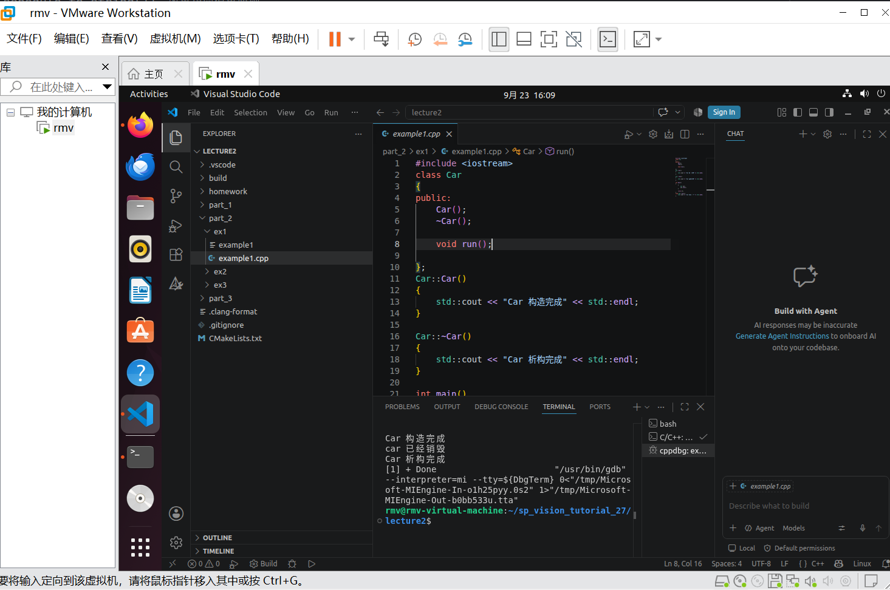
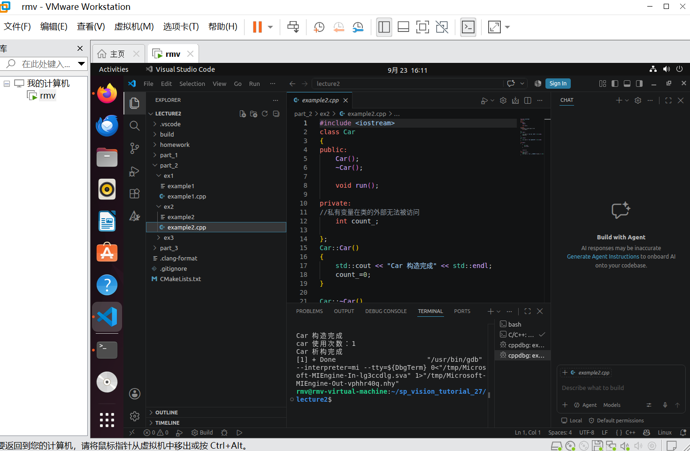
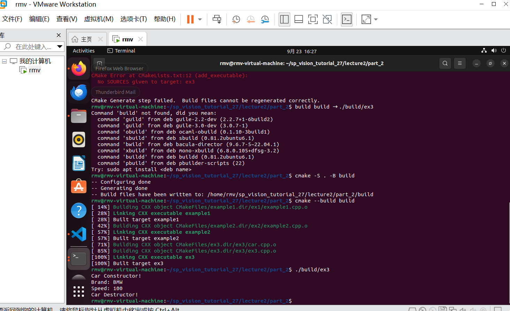
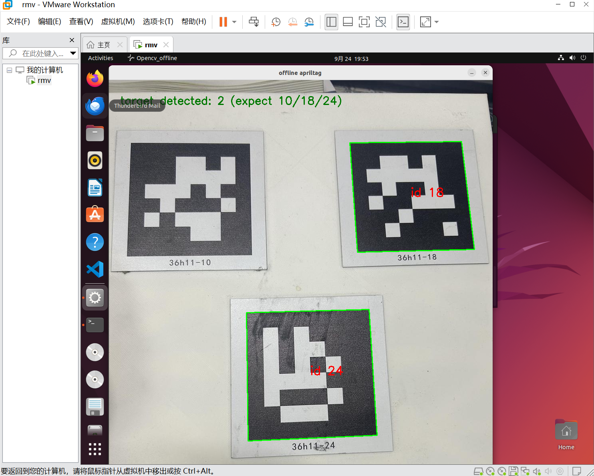
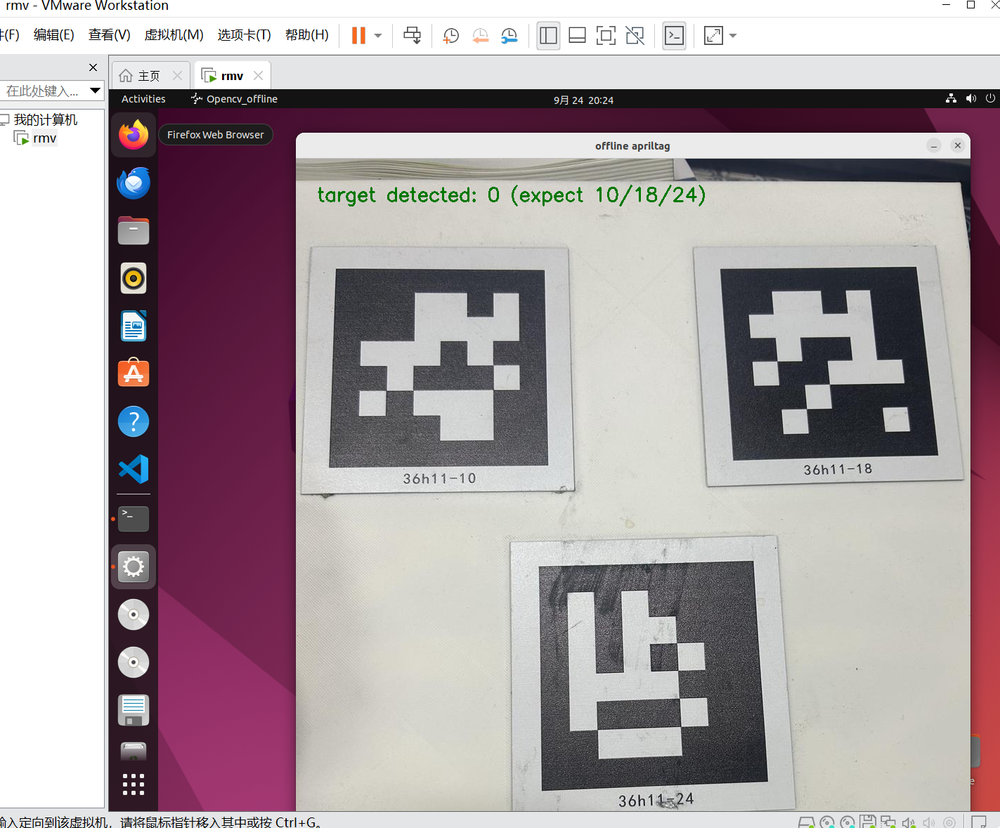
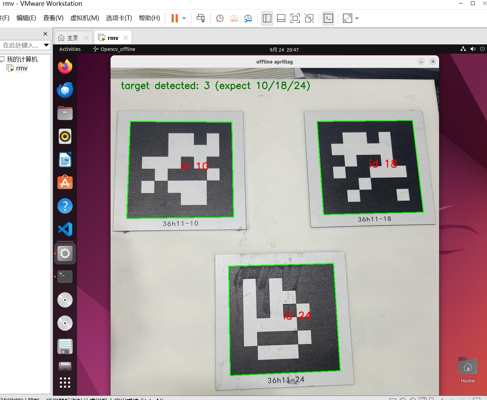
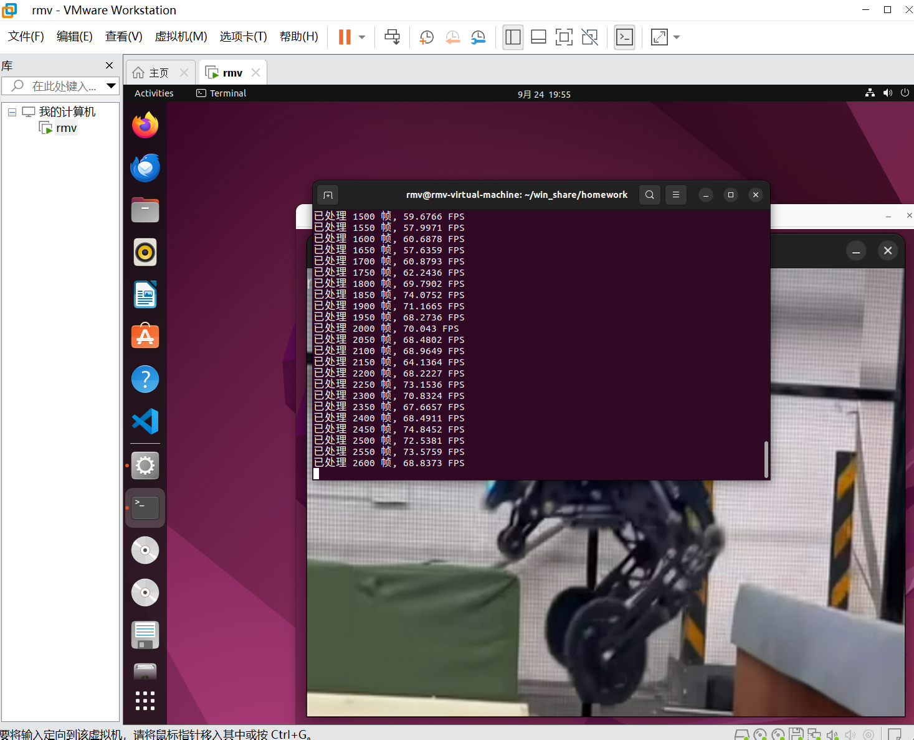
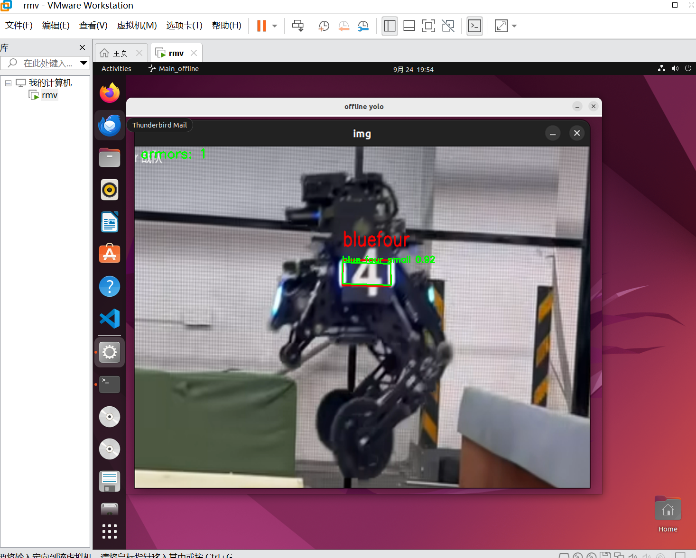

# L2

## 图1　ex1：构造与析构

- Car 类：构造函数、析构函数、run()。
- 输出顺序：Car 构造完成 → Car 析构完成。

## 图2　ex2：私有成员

- 新增 private 成员 int count_，构造时初始化为 0。
- run() 输出 car 使用次数：1；私有成员仅类内可访问。

## 图3　ex3：多文件工程

- Car 类拆分为 car.cpp，与 ex3.cpp 分开编译。
- 报错：add_executable(ex3) 未指定源文件；补全后编译通过。
- 命令：cmake -S . -B build；cmake --build build。
- 运行输出：Car Constructor! / Brand: BMW / Speed: 100 / Car Destructor!

## 图4　附加作业：AprilTag 检测（2/3）

- 输入：36h11 标志板真实照片，目标 id 10/18/24。
- 结果：id 18、24 检出；id 10 漏检（板面反光，黑色块发灰）。

## 图5　附加作业：调参失败（0/3）

- 修改自适应阈值参数后重新检测。
- 结果：id 10/18/24 均未检出，参数恢复默认值。

## 图6　附加作业：调参后（3/3）

- 在 OpenCV 4.5.4 上对同一照片扫描参数，阈值常数取 20（11/13/15 有重复框，弃用）。
- 改动：yolo.yaml 中 adaptive_thresh_constant 7→20，仅一行，无需编译。
- 结果：id 10/18/24 全部检出，各一个框，id 标注正确。

## 图7　作业二：连续运行帧率

- YOLO 离线程序连续处理视频，每 50 帧打印一次 FPS。
- 结果：处理 2600+ 帧，帧率 57~74 FPS，无崩溃。

## 图8　作业二：装甲板识别结果

- 输入：真实场地照片；输出：blue four small，置信度 0.92。
- 装甲板四个关键点画绿色闭合框，左上角 armors: 1。
